# Diffusion-Model-Demo

This repository is pytorch implement of ```Denoising Diffusion Probabilistic Models```.

## UNet in diffusion model of default configure in this repository

### Macro model structure 

<div align=center></div>

### Sublayers

<div align=center></div>

## math

### hyper parameters

the following parameters are set manually.

$$
\alpha_0,\alpha_1,\alpha_2, ..., \alpha_n
$$

the following parameters are computed from the above parameters.


$$
\bar{\alpha}_t = \prod_{i=1}^t{\alpha}_i
$$


$$ 
x_t = \sqrt{\bar{\alpha}_t}x_0 + \sqrt{1 - \bar{\alpha}_t}\epsilon_0;\quad \epsilon_0 \sim \mathcal{N}\left(x_t; \sqrt{\bar{\alpha}_t}x_0, \left(1-\bar{\alpha}_t\right)\mathbf{I}\right)
$$

$$
\sigma^2\left(t\right) = \frac{\left(1-\alpha_t\right)\left(1 - \bar{\alpha}_{t-1}\right)}{1-\bar{\alpha}_t}
$$

### training

the optimization goal of the Decoder is to predict $\mu_t$ so that it is as possible with the target.


$$
\mu_{target} = \frac{\sqrt{\alpha_t}\left(1 - \bar{\alpha}_{t-1}\right)x_t+\sqrt{\bar{\alpha}_{t-1}}\left(1-\alpha_t\right)x_0}{1-\bar{\alpha}_t}
$$


$$
\mu_{prediction} = \frac{\sqrt{\alpha_t}\left(1 - \bar{\alpha}_{t-1}\right)x_t+\sqrt{\bar{\alpha}_{t-1}}\left(1-\alpha_t\right)\hat{x}_{\theta}\left(x_t, t\right)}{1-\bar{\alpha}_t}
$$


$\hat{x}_{\theta}\left(x_t, t\right)$ is the Decoder(a.k.a Unet with Multi Head Self-Attention).

the loss function is:


$$
\log{p(x)} = \mathbb{E_{q\left(x_1|x_0\right)}}\left[\log{p_{\theta}}(x_0|x_1)\right] - D_{KL}\left(q(x_T|x_0)||p(x_T)\right) - \sum_{t=2}^T{\mathbb{E}_{q(x_t|x_0)}\left[D_{KL}(q(x_{t-1}|x_t, x_0))||p_{\theta}(x_{t-1}|x_t)\right]}
$$


the last term is a diffusion process.

### inference

$$
x_t = \sqrt{\bar{\alpha}_t}x_0 + \sqrt{1 - \bar{\alpha}_t}\epsilon_{\theta};\quad \epsilon_{\theta} \sim \mathcal{N}\left(\mu_{prediction},\sigma^2\left(t\right)\mathbf{I}\right)
$$

## Training

```shell
$ git clone https://github.com/yl-jiang/Diffusion-Model-Demo.git
$ cd Diffusion-Model-Demo
$ conda activate your_pytorch_environment
$ python train.py
```

if everything is ok, then you will see something like this:

```shell
Logging at: Logs_Checkpoints/Inference/version_0
Model Checkpoint at: Logs_Checkpoints/checkpoints/version_0
Train :: Epoch: 1/30:   9%|█▏          | 42/469 [00:06<00:49,  8.61it/s, Loss: 0.0507]

```

## MNIST Demo

<div align=center></div>

## Reference

1. [zhangbo2008 / diffusion_demo](https://github.com/zhangbo2008/diffusion_demo);
2. [jadore801120 / attention-is-all-you-need-pytorch](https://github.com/jadore801120/attention-is-all-you-need-pytorch);
3. [learnopencv/Guide-to-training-DDPMs-from-Scratch](https://github.com/spmallick/learnopencv/tree/master/Guide-to-training-DDPMs-from-Scratch);
