# Diffusion-Model-Demo

This repository is pytorch implement of ```Denoising Diffusion Probabilistic Models```.

## UNet in diffusion model of default configure in this repository

### Macro model structure 

<div align=center></div>

### ResnetBlock

<div align=center></div>

### ResnetBlock with Attention

<div align=center></div>

### Final layers

<div align=center></div>

## Training

```shell
$ git clone https://github.com/yl-jiang/Diffusion-Model-Demo.git
$ cd Diffusion-Model-Demo
$ conda activate your_pytorch_environment
$ python train.py
```

if everything is ok, then you will see something like this:

```shell
Logging at: Logs_Checkpoints/Inference/version_0
Model Checkpoint at: Logs_Checkpoints/checkpoints/version_0
Train :: Epoch: 1/30:   9%|█▏          | 42/469 [00:06<00:49,  8.61it/s, Loss: 0.0507]

```

## Reference

1. [zhangbo2008 / diffusion_demo](https://github.com/zhangbo2008/diffusion_demo);
2. [jadore801120 / attention-is-all-you-need-pytorch](https://github.com/jadore801120/attention-is-all-you-need-pytorch);
3. [learnopencv/Guide-to-training-DDPMs-from-Scratch](https://github.com/spmallick/learnopencv/tree/master/Guide-to-training-DDPMs-from-Scratch);